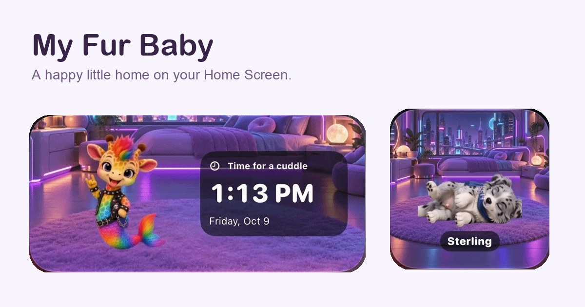
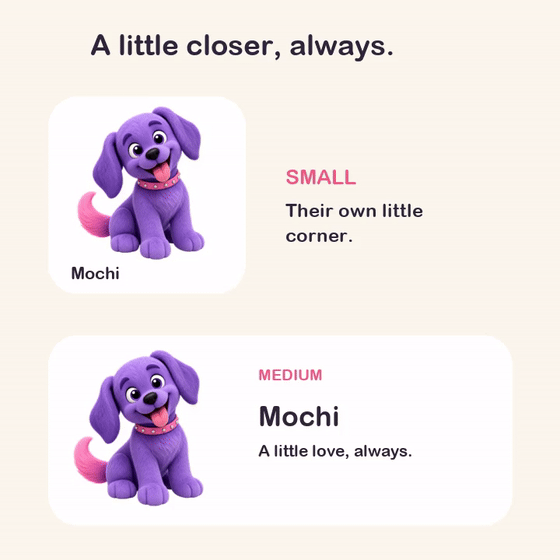
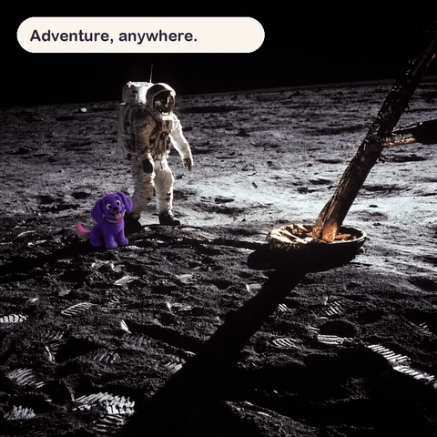

# My Fur Baby 🐾

**A happy little home on your Home Screen.**

Dream up a Fur Baby, give them a cozy widget, and bring them along on photo adventures. A native iOS app built with SwiftUI and WidgetKit.

[**Explore the website →**](https://greggroll.github.io/MyFurBaby/)

**App Store: coming soon.** The download link will appear on the website when the app launches.



## Meet the widgets

- **Small and wide layouts:** keep your pet close in their own little corner.
- **Clock, daily quote, calendar, or pet info:** make a wide widget your own.
- **Backgrounds with personality:** a cozy living room, neon bedroom, clear or solid color, and custom generated scenes saved to a gallery.
- **Playful and sleepy moods:** prepare and replay your pet’s saved animations.

<p align="center"></p>

## Take them on an adventure

Choose your own photo, describe where your pet should be, and create a memory together. Completed photo adventures save to an in-app gallery, ready to reopen, share, or save to Photos.

<p align="center"></p>

## Dream up your little friend

Choose their species, colors, accessories, gender, and name. The creation flow introduces your pet and lets you confirm their name. Widgets, animations, and photo adventures require Pro; AI generation uses in-app credits. Saved artwork and animations can be reused.

The GIFs are presentation demos adapted from the app’s bundled onboarding videos. The widget screenshots are actual Home Screen captures. The app is in development; see the development notes for device validation and purchase-testing status.

## Run the iOS app

1. Open `MyFurBaby.xcodeproj` in Xcode.
2. Select the **MyFurBaby** scheme and an iPhone simulator. The app targets iOS 17+.
3. For a local walkthrough without provider charges, add `FURBABY_SAMPLE_MODE=true` and a fresh `FURBABY_STORAGE_SUITE` value to the Debug scheme’s environment variables.
4. Build and run. For a device, configure your own signing team, bundle identifiers, and App Group.

Release builds use the connected backend. To run your own service, configure it below and use `FURBABY_SERVICE_URL` in a Debug build. Provider credentials belong on the backend.

## Run the backend

Requires Node.js with built-in SQLite support (Node 22.13+ or a current LTS) and FFmpeg for animation processing.

```sh
cd backend
npm ci
cp .env.example .env
# Set your own provider keys and Apple verification settings in .env.
npm start
```

For a fresh checkout, copy `.env.example` as shown; preserve any existing `.env`. Never commit provider keys, signing credentials, account data, or generated databases.

```sh
cd backend
npm test
```

Run the iOS tests from **Product → Test** in Xcode.

## Project map

| Folder | Contents |
| --- | --- |
| `App/` | SwiftUI app, pet creation, adventure gallery, and widget studio |
| `Widget/` | WidgetKit extension |
| `Shared/` | Models, shared storage, generation client, and animation support |
| `Resources/` | App branding, backgrounds, bundled demos, and StoreKit configuration |
| `backend/` | Image/video generation, credit ledger, and Apple transaction verification |
| `website/` | Static marketing page and public media |
| `Tests/` | iOS tests |
| `docs/` | Implementation, deployment, and validation notes |

## Website and documentation

The marketing page deploys from `website/` to GitHub Pages on pushes to `main`. No framework or build step is required.

```sh
python3 -m http.server 8080 --directory website
```

Open `http://localhost:8080` to preview. See [website maintenance](docs/MARKETING_PAGE.md) for updating the App Store link.

- [Development details and release history](docs/DEVELOPMENT.md)
- [Onboarding](docs/ONBOARDING.md)
- [Widget customization](docs/WIDGET_CUSTOMIZATION.md)
- [Widget animation](docs/WIDGET_ANIMATION.md)
- [Photo adventures and backgrounds](docs/GALLERY_AND_WIDGET_BACKGROUNDS.md)
- [Backend deployment](docs/BACKEND_DEPLOYMENT.md)
- [Third-party notices](THIRD_PARTY_NOTICES.md)

Local validation media, release exports, credentials, and account databases are excluded from this public repository. Historical validation notes may refer to these local artifacts.
